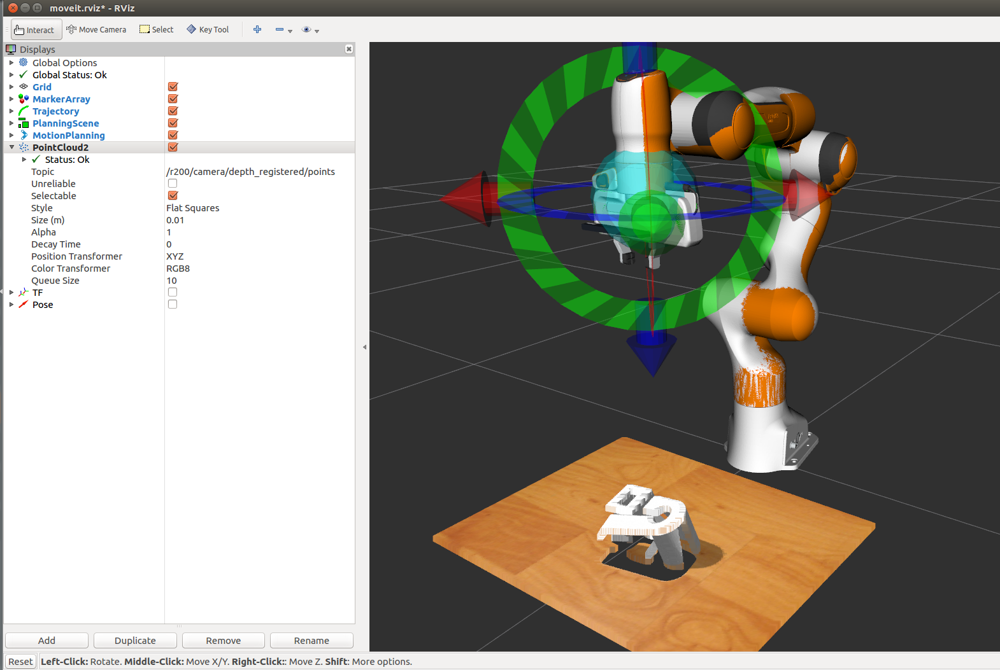

# Intel RealSense ROS plugin for Gazebo and MoveIt!

Simulation of the Realsense R200 sensor in Gazebo.

## Use of Package 

This package is used to obtain color and depth image and depth registered points from a RS200 camera attached to the wrist of a Franka Emika Panda Robot. 

## Parts used for Panda Simulation

Added the [Realsense xacro](realsense_gazebo_plugin/blob/master/urdf/realsense-RS200.macro.xacro) to the Panda xacro in ```franka_description```

Generated a point cloud from the depth image by running

```
roslaunch realsense_gazebo_plugin depth_proc.launch
```
No need to launch seperately. Already added to the simulation launch file in ```panda_simulation```

## MoveIt! Rviz Setup

Add PointCloud2 in Rviz and select topic as shown in image




## Save Point Cloud as OBJ file

The point cloud data obtained from the camera can be saved as an .obj file by running 

```
rosrun src/SavePointCloud.cpp
```
## Acknowledgement

This is a modified and updated version of the work done by [SyrianSpock](https://github.com/SyrianSpock/realsense_gazebo_plugin) 
